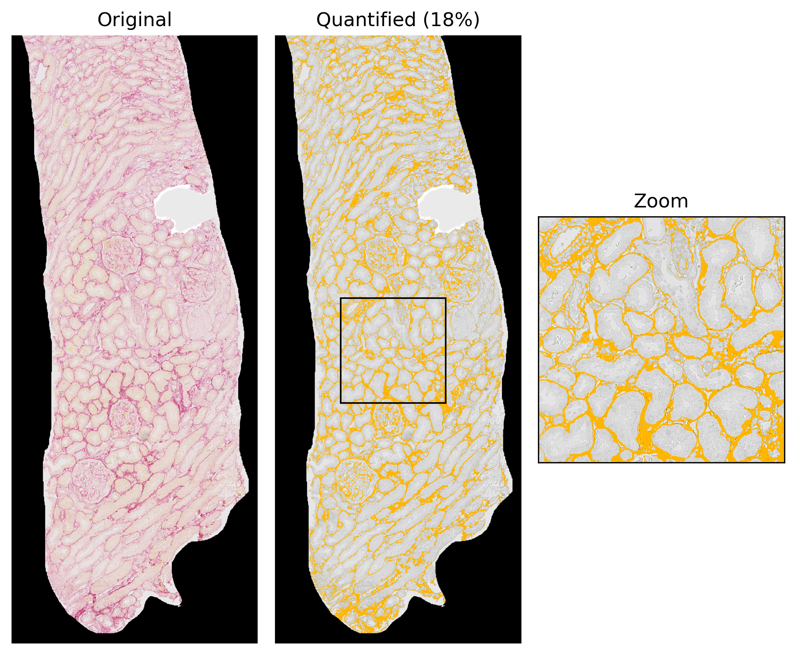

# Quantification of kidney fibrosis

The goal of this project is to quantify the amount of fibrosis in kidney biopsies and to display the result (percentage) and visualize the fibrosis on the [EMPAIA platform](https://www.empaia.org/en). 

**TODO**
- [x] Compute amount of fibrosis as a percentage
- [x] Display percentage of fibrosis on EMPAIA platform 
- [x] Select a saturation thresholds, see Issue #1
- [x] Visualize fibrosis in image
- [x] Write function to get (x,y) coordinates of the quantified pixels
- [ ] Visualize fibrosis on EMPAIA platform 

**Example visualization of the quantified fibrosis**

**WSI examples**

Images can be found [here](https://1drv.ms/f/s!AhNRStGceBGkic41KBJ1qpv63QOHZQ?e=dml31P)
